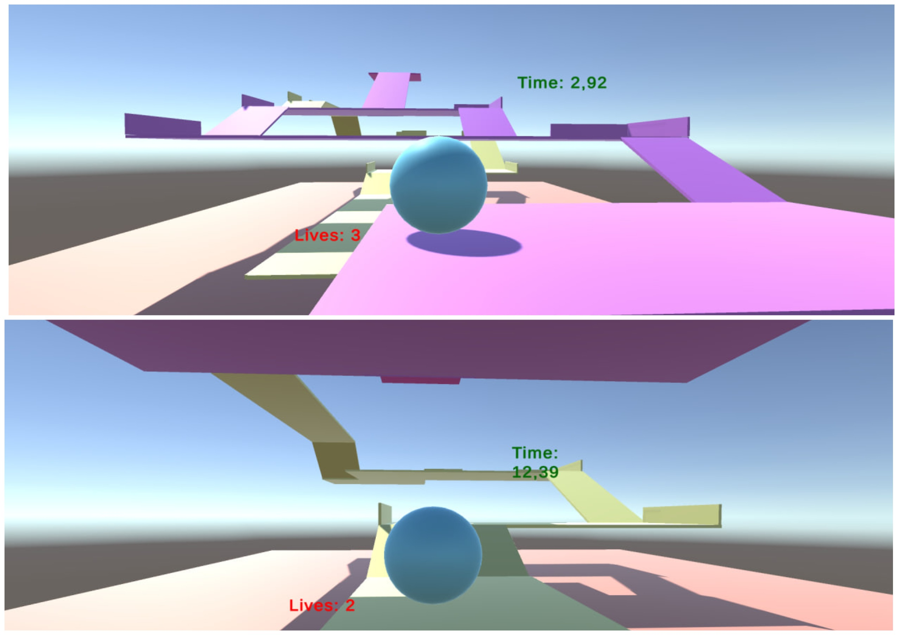
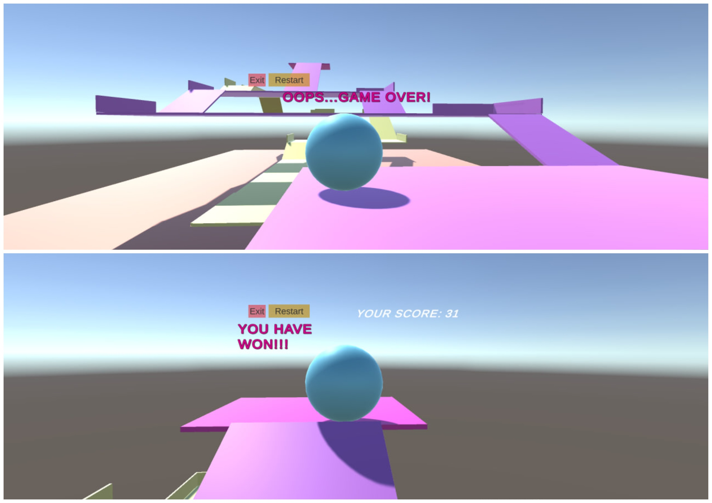

# Ball Game 🎮
Гра була розроблена за допомогою Unity та її основна задача полягає в тому, щоб кулька дісталась до найвищої платформи. Кулька може рухатись лише направо, наліво, вперед та назад. Якщо вона потрапляє на нижній рівень - віднімається одне життя з трьох.

##  Game Overview
Під час гри працює таймер, що засікає витрачений час - чим менший час проходження, тим кращий результат. Кулька може рухатись як по жовтому, так і по рожевому шляху - обидва ведуть до цілі. Також, в процесі гри можна розпочати спочатку за допомогою натискання 'R'.
  

  
У випадку програшу або виграшу, можна розпочати заново, або вийти з гри.
  
